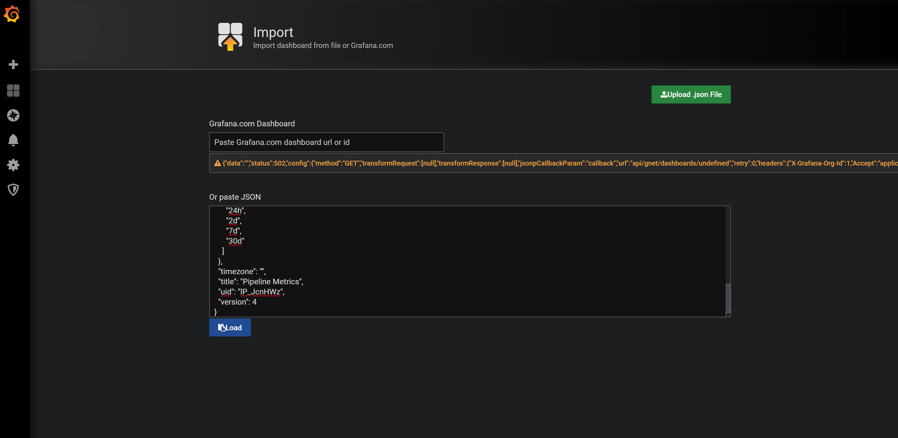

Pipelines Docker Example
--------------------------------

This folder contains 3 files for running
a self contained example
with model serving and a metrics dashboard.

Config.json: Contains the serving configuration.

Dashboard.json: A dashboard you can import in to grafana.

Prometheus.yml: A pre configured prometheus data source
that points at the metrics endpoint exposed by the pipelines server.


Running
-------------------------


In order to run this example, first
a model server docker container needs to be built.
 
This can be done in the root directory with:
```
mvn -Pdocker -Dchip=cpu -Ppython clean install -Dmaven.test.skip=true
``` 
 
Afterwards a docker container that will be used with docker compose
will have been built. Note this is for cpu. 
if you want gpu, use -Dchip=gpu.

 
```
docker-compose up
```

This will start 3 servers:

[Grafana](https://grafana.com/): The metrics dashboard.

[Prometheus](https://prometheus.io/): The metrics server.

Pipelines server:  The actual model serving component.

After this, you can start to send
requests to the pipelines server
on port 65322.

Visualization
--------------------

In order to visualize metrics from the server,
we need to import the dashboard in to grafana.
In order to do that, we need to import the dashboard.json. 

Point your browser to:
```
http://localhost:3000
```

When you login, login with:
```
User name: admin
Password:  password
```


Click import at the top left:


Copy and paste the json in to the import page as follows:



Afterwards, click import:


Your dashboard will then render:


This dashboard contians metrics for system load and memory as well
as timings for performing inference and ETL.


Customizing the dashboard
------------------------------------

If you want to create a custom dashboard, please read the grafana documentation.
You will also need to learn the prometheus squery language.
In general, just specify a metric name when you create a new dashboard.


Using the server
-------------------------------

Docker automatically starts the server. Now we need to connect using the client.
THe client can either be installed locally or you can use it in docker.

In order to use the client, we need to connect to the port the server started on.


```python
from pipes import Client
input_names = ['default']
output_names = ['default']
port = 65322

client = Client(input_names=input_names,
                output_names=output_names,
                return_output_type='ARROW',
                input_type='JSON',
                endpoint_output_type='RAW',
                url='http://localhost:' + str(port))

data_input = {'first': 'value'}

predicted = client.predict(data_input)
print(predicted)

```

This should be able to connect to the server
and output the server run python script 
as json.

